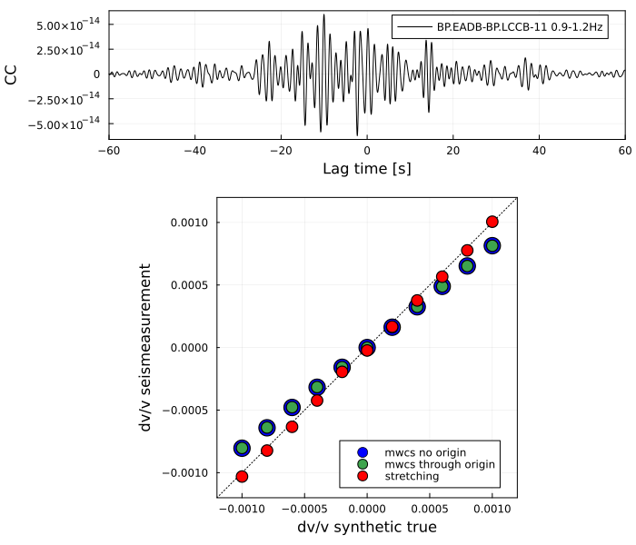
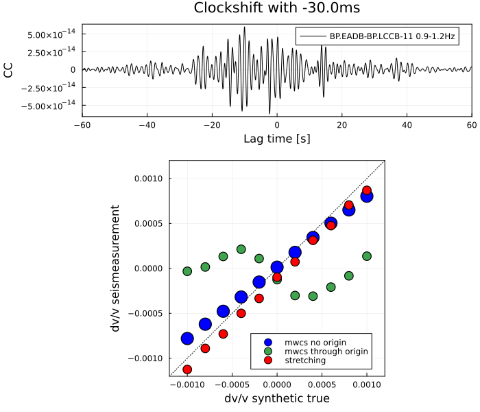

Figure 1. Validation of dv/v measurement using the stretching and MWCS with and without imposing the zero intersect.

Figure 2. Time-shifted cross-correlation function

Figure 3. Validation of dv/v with the time-shift to mimic the clock drift.
